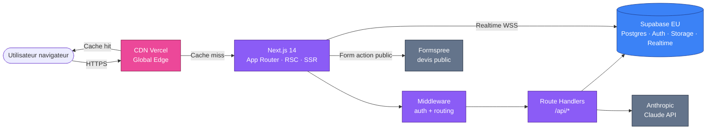
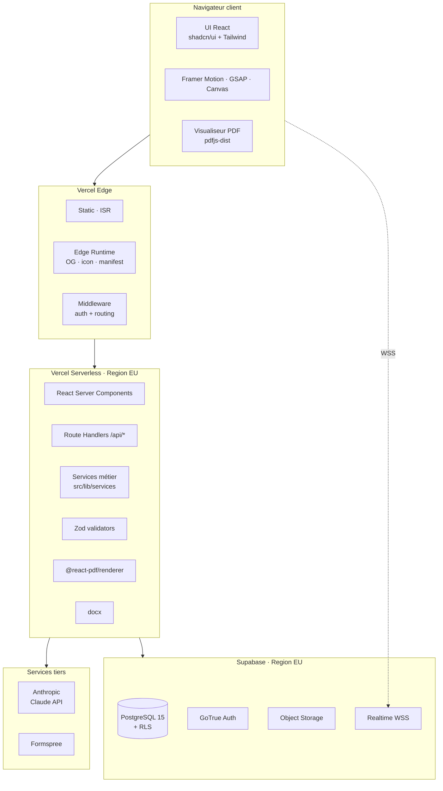
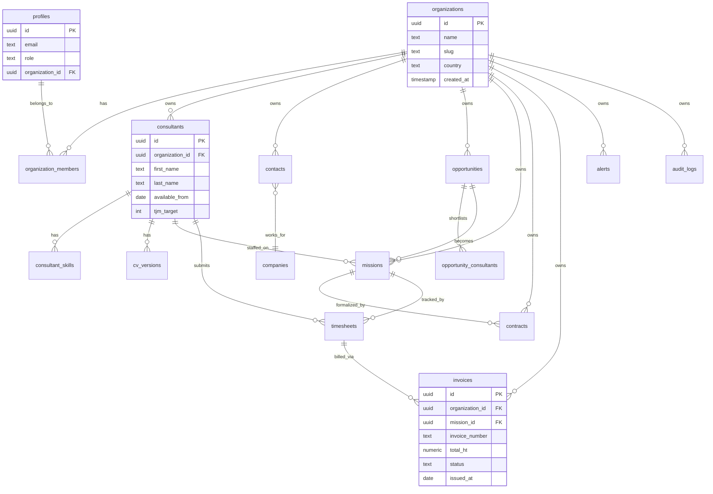
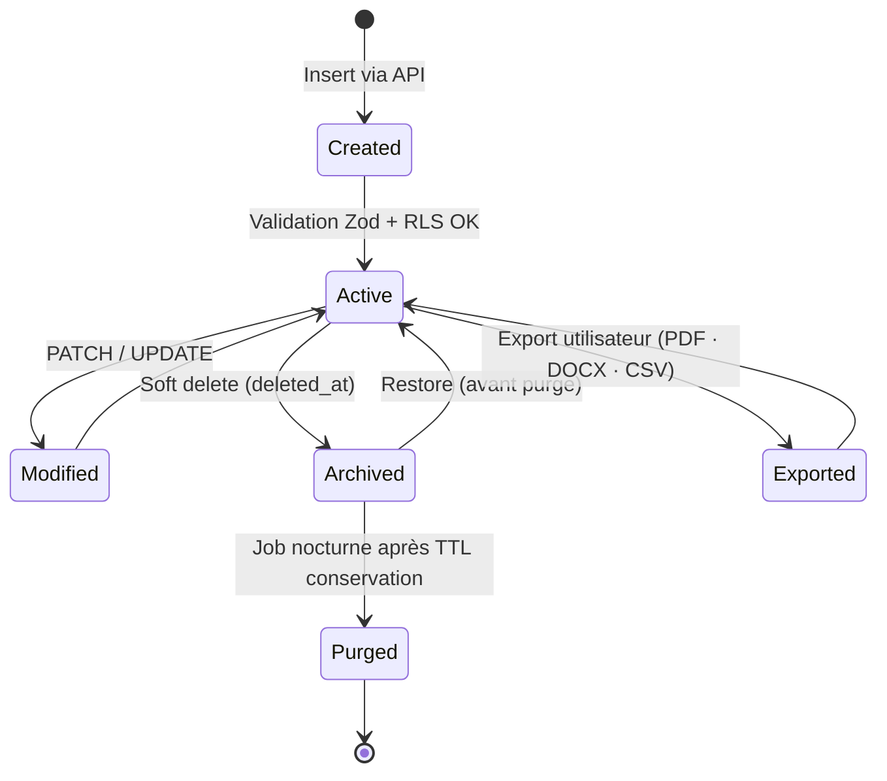
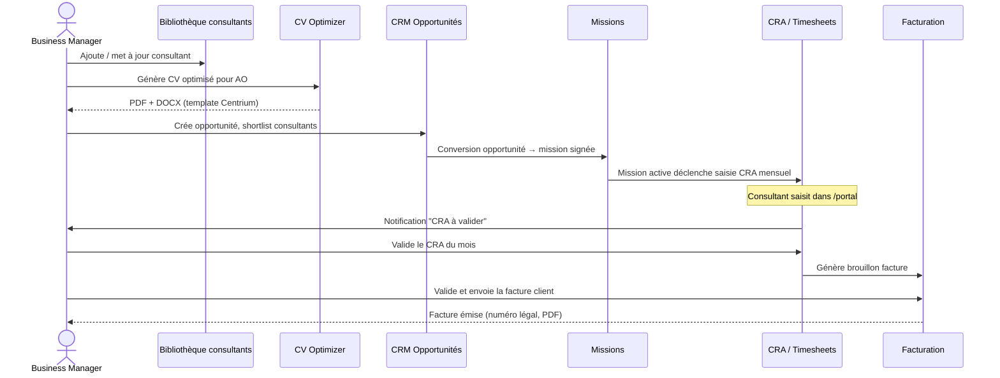
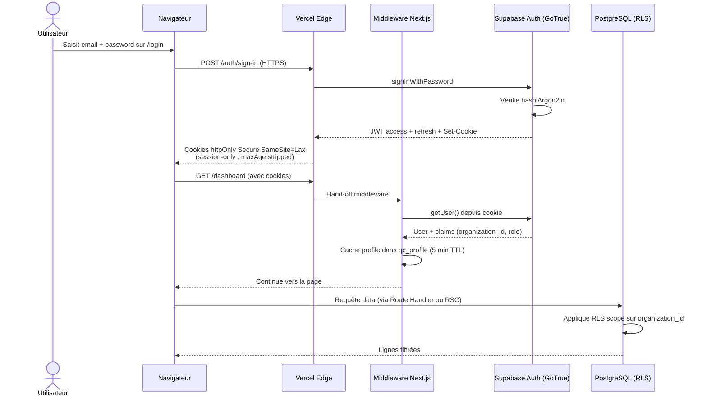
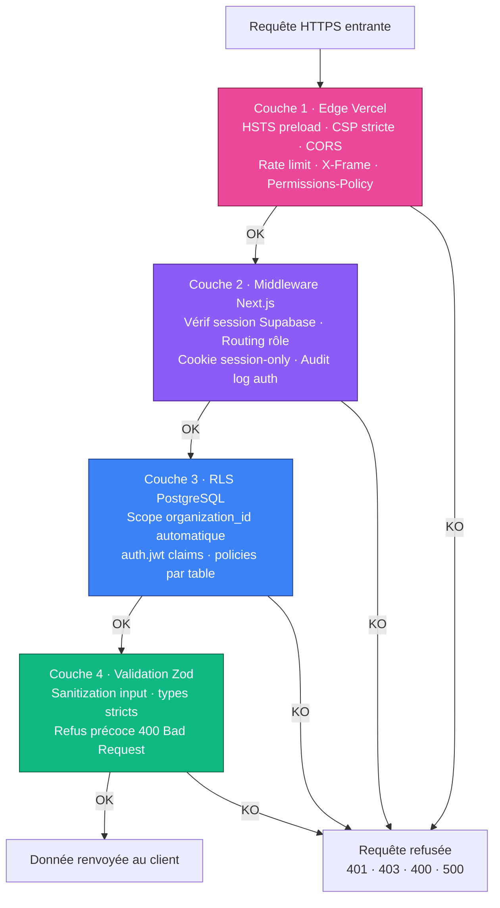
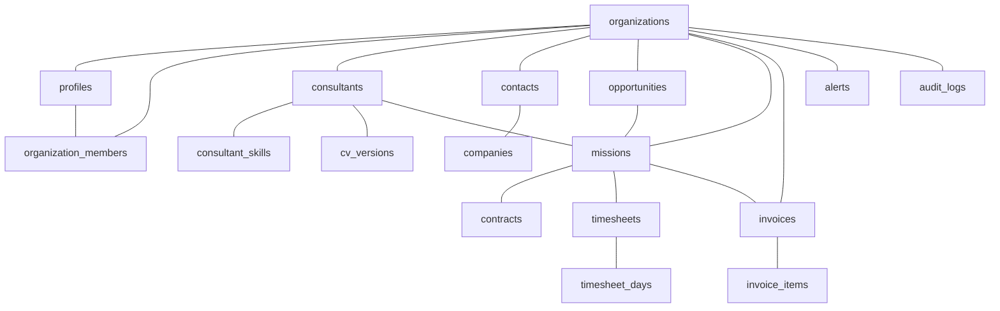

# Centrium — Architecture Overview

> Document technique destiné aux DSI, architectes solutions, RSSI et auditeurs externes.
> Décrit l'architecture applicative, le modèle de données, la posture de sécurité,
> le pipeline de déploiement, l'observabilité et la roadmap technique sur 12 mois.

---

## 1 · Synthèse exécutive

Centrium est une plateforme SaaS B2B mono-page applicative bâtie sur trois socles
indépendants et complémentaires :

1. **Frontend Next.js 14 (App Router)** déployé sur Vercel, mêlant Server Components,
   Server-Side Rendering, Route Handlers et runtime Edge ciblé. Toutes les pages
   sont servies avec une politique d'en-têtes HTTP stricte (HSTS preload, CSP,
   X-Frame-Options, Permissions-Policy en lockdown).
2. **Backend Supabase** (PostgreSQL 15, Auth GoTrue, Storage S3-compatible,
   Realtime) hébergé en région européenne. L'ensemble du modèle relationnel est
   protégé par Row Level Security (RLS) avec scoping `organization_id`.
3. **Service IA Anthropic Claude API** appelé exclusivement côté serveur, sans
   entraînement sur les données client (politique Anthropic Enterprise), pour
   les modules CV Optimizer, parsing d'appels d'offres, matching et assistant
   comptable.

Le tout est gouverné par un **modèle multi-tenant strict** : chaque organisation
cliente est isolée logiquement par RLS et physiquement par scoping de bucket
Storage. Aucune réplication hors UE. Aucun stockage de PII dans les CDN edge.

**Caractéristiques clés** :

| Dimension | Caractéristique |
|---|---|
| Architecture | Serverless edge-first, stateless côté frontend, PostgreSQL stateful unique côté backend |
| Multi-tenancy | Logique (RLS PostgreSQL + scoping bucket), pas de container par tenant |
| Authentification | Supabase Auth (cookie httpOnly Secure SameSite=Lax, session-only) |
| Chiffrement | TLS 1.2+ en transit, AES-256 au repos (DB + Storage) |
| Localité | Région EU exclusive (DB + Auth + Storage), CDN global Vercel |
| Disponibilité cible | 99,9 % mensuel (SLA contractuel sur plan Enterprise) |
| RTO / RPO | RTO 4 h · RPO 24 h (PITR 7 jours) |
| Conformité | RGPD, DPA signable, sous-traitants documentés, audit SOC 2 Type I prévu Q4 2026 |
| Performance | First Load JS shared 87.8 kB · LCP cible < 2,5 s · INP cible < 200 ms · CLS cible < 0,1 |

**Décisions structurantes** :

- **Pas d'auto-hébergement on-premise.** Centrium est et reste un SaaS managé.
  Cela évite la dispersion d'effort sur des packagings hétérogènes et garantit
  une posture de sécurité homogène sur la totalité de la base installée.
- **Pas de mode offline.** Le produit est online-first. Une coupure réseau
  prolongée bloque l'usage temporairement, mais aucune donnée n'est perdue
  (toutes les écritures transitent par la base centrale).
- **Pas de régions hors UE.** Cela ferme la porte aux clients qui exigent un
  hébergement US ou APAC, mais c'est un choix de conformité assumé pour servir
  un marché européen exigeant en matière de souveraineté des données.

---

## 2 · Architecture applicative

### 2.1 Vue d'ensemble



### 2.2 Couches applicatives

#### 2.2.1 Frontend Next.js 14

L'application utilise l'**App Router** introduit en Next.js 13.4 et stabilisé
en 14.x. Les composants sont **Server Components par défaut** ; le marqueur
`'use client'` n'est utilisé qu'aux frontières d'interactivité (forms,
animations Framer Motion, hooks de Realtime).

Modes de rendu utilisés :

| Mode | Usage | Exemples |
|---|---|---|
| RSC (React Server Components) | Pages applicatives authentifiées | `/dashboard`, `/consultants`, `/crm` |
| SSR (Server-Side Rendering) | Pages dynamiques avec données utilisateur | `/cv-optimizer/[id]` |
| ISR (Incremental Static Regeneration) | Pages vitrine et documentation | `/`, `/pricing`, `/plateforme` |
| Edge runtime | Métadonnées dynamiques | `opengraph-image.tsx`, `icon.tsx`, `manifest.ts`, `robots.ts`, `sitemap.ts` |
| Client | Interactions, animations, Realtime | Composants `'use client'` à granularité fine |

#### 2.2.2 Route Handlers `/api/*`

Les **Next.js Route Handlers** servent de couche API serverless. Chaque
handler suit le contrat documenté dans `.claude/rules/api-conventions.md` :

1. **Authentification** via `createClient()` côté serveur (Supabase SSR client).
2. **Validation Zod** systématique du corps de requête et des query params.
3. **Logique métier** déléguée à un service dans `src/lib/services/*`.
4. **Réponse JSON** au format `{ data }` (succès) ou `{ error, details? }` (échec).

Pas de framework REST tiers (Express, Fastify, Hono) : la simplicité native
de Next.js suffit et évite une couche d'abstraction inutile.

#### 2.2.3 Middleware d'authentification

Le fichier `src/lib/supabase/middleware.ts` (exécuté en runtime Edge par
`middleware.ts` à la racine) intercepte **toutes les requêtes**. Il assure :

- **Vérification de session** Supabase (lecture cookie + appel `getUser()`).
- **Routing par rôle** :
  - `consultant` → confiné au préfixe `/portal/*`
  - `admin` / `business_manager` / `recruiter` / `finance` → routes applicatives
  - `super_admin` → confiné au préfixe `/admin/*`, pas d'organisation rattachée
- **Onboarding obligatoire** si `organization_id` est null.
- **Cookie cache `qc_profile`** (TTL 5 min) pour éviter une requête DB à chaque navigation.
- **Session-only** : `maxAge` et `expires` sont supprimés des cookies Supabase,
  imposant une re-authentification à la fermeture complète du navigateur.

Le middleware **ne fait pas autorité** sur la sécurité : il guide le routing.
La sécurité réelle est appliquée au niveau base par RLS PostgreSQL.

#### 2.2.4 Backend Supabase

Supabase fournit quatre services intégrés exploités par Centrium :

- **PostgreSQL 15** — modèle relationnel, RLS, fonctions PL/pgSQL, triggers
- **Auth (GoTrue)** — authentification email/password, magic link, invitations
- **Storage (S3-compatible)** — buckets pour CV, contrats, factures, logos
- **Realtime** — abonnements `postgres_changes`, presence, broadcast

Chaque organisation cliente est représentée par une ligne dans la table
`organizations`, et chaque utilisateur est rattaché via `organization_members`.

#### 2.2.5 Services tiers

| Service | Usage | Donnée transmise | Conformité |
|---|---|---|---|
| **Anthropic Claude API** | Modules IA (parsing CV, matching AO, assistant comptable) | Extraits de CV, descriptifs d'AO, messages comptables | Politique "no training" Enterprise, hébergement US — données client traitées sans persistance d'entraînement |
| **Vercel** | Hébergement frontend, CDN, OG images Edge | Fichiers HTML/JS/CSS publics + logs | DPA Vercel signé, région EU pour les fonctions serverless |
| **Formspree** | Réception du formulaire `/devis` (public, pré-authentification) | Nom, email, contexte ESN du prospect | DPA Formspree signé — à migrer vers endpoint interne Q3 2026 |
| **Stripe** | Facturation produit Centrium (à venir Q4 2026) | Email facturation, méthode paiement | Tokenisation Stripe, aucune donnée carte stockée chez Centrium |

### 2.3 Diagramme composants



### 2.4 Multi-tenant via `organization_id` + RLS

L'isolation des tenants ne repose **pas** sur des instances séparées (pas de
"VPC par client", pas de "base par client"). Elle repose sur :

1. **Une colonne `organization_id`** présente sur toutes les tables sensibles.
2. **Des policies RLS PostgreSQL** qui filtrent automatiquement les lignes
   selon le JWT de l'utilisateur authentifié :

   ```sql
   CREATE POLICY consultants_org_isolation
     ON public.consultants
     FOR ALL
     USING (organization_id = (auth.jwt() ->> 'organization_id')::uuid);
   ```

3. **Des buckets Storage** scopés par convention (`org-{uuid}/cvs/...`,
   `org-{uuid}/contracts/...`) avec policies de lecture/écriture vérifiant
   le préfixe.

4. **Aucun rôle applicatif "super-admin global"** ne peut lire des données
   client en production sans escalade explicite documentée. Le rôle
   `super_admin` Centrium opère sur `/admin/*` (gestion produit, support
   métier) mais ne contourne pas les RLS — toute requête support sur les
   données d'un tenant nécessite un consentement écrit du client et passe
   par une procédure d'escalation tracée.

### 2.5 Pourquoi cette architecture ?

- **Vélocité produit** : Next.js + Supabase est aujourd'hui le combo le plus
  productif pour un SaaS B2B de taille intermédiaire. Aucune équipe SRE
  dédiée requise jusqu'à plusieurs milliers de tenants.
- **Coût opérationnel maîtrisé** : pas de cluster Kubernetes à gérer, pas de
  pipeline de déploiement maison, pas de gestion d'infrastructure manuelle.
- **Posture sécurité par défaut** : RLS Postgres est éprouvé, les en-têtes
  HTTP sont déclaratifs, Supabase Auth gère les cas critiques (rotation
  refresh token, hashage password Argon2id).
- **Réversibilité** : PostgreSQL est standard, dump pg_dump exploitable
  ailleurs. Pas de "vendor lock-in" sur des services propriétaires.

---

## 3 · Architecture des données

### 3.1 Modèle conceptuel

Centrium s'articule autour d'un cycle métier ESN linéaire (sourcing → facturation)
avec quelques entités transverses (contacts, alerts, audit). Les tables sont
toutes scopées par `organization_id`, à l'exception de `organizations`,
`profiles` et `organization_members` qui définissent la relation user/org.



### 3.2 Tables principales

| Table | Rôle | Volume cible | Conservation |
|---|---|---|---|
| `organizations` | Tenant ESN | 1 ligne / client | Pendant contrat + 30 j post-résiliation |
| `profiles` | Utilisateurs étendus (rôle, langue, préférences) | N par org | Pendant contrat + 30 j |
| `organization_members` | Relation user ↔ org (rôle, droits) | N par org | Pendant contrat |
| `consultants` + `consultant_skills` + `consultant_documents` | Bibliothèque consultants | Quelques dizaines à milliers par org | 3 ans après dernière activité (RGPD) |
| `cv_versions` + `cv_templates` | Historique CV optimisés | Plusieurs par consultant | Pendant contrat |
| `clients`, `companies`, `contacts`, `tags` | Carnet d'adresses CRM | Variable | Pendant contrat |
| `opportunities` + `opportunity_consultants` | Pipeline commercial | Quelques centaines par an | Pendant contrat |
| `job_offers`, `missions` | Offres et missions actives | Quelques dizaines par an | Pendant contrat + 3 ans |
| `timesheets` + `timesheet_days` | CRA | 12 × N consultants par an | **10 ans (obligation comptable FR)** |
| `invoices` + `invoice_items` | Factures émises | Quelques centaines par an | **10 ans (Code de commerce art. L123-22)** |
| `messages`, `alerts`, `activities`, `notes` | Messagerie interne, audit métier | Variable | 1 à 5 ans selon catégorie |
| `audit_logs` | Audit sécurité (auth, exports, suppressions, changements de rôle) | Variable | **5 ans (recommandation CNIL)** |

### 3.3 Cycle de vie de la donnée



**Politique de suppression** : Centrium ne pratique **pas** de hard delete
immédiat. Toutes les entités métier sensibles utilisent un soft delete
(`deleted_at`) puis sont **purgées** par un job nocturne après le TTL de
conservation. Cela permet :

- **Restauration accidentelle** par l'admin de l'organisation dans la fenêtre TTL
- **Conformité obligations comptables** (factures, CRA — 10 ans)
- **Conformité RGPD** "droit à l'effacement" : hard delete sur demande
  utilisateur dans le respect des obligations légales (les factures
  ne peuvent pas être supprimées avant 10 ans).

### 3.4 Conservation par catégorie

| Catégorie | Durée | Fondement |
|---|---|---|
| Factures émises | 10 ans | Code de commerce art. L123-22 |
| CRA validés | 10 ans | Pièces comptables justificatives |
| Consultants inactifs (aucune activité depuis 3 ans) | Anonymisation puis purge à 3 ans | RGPD — minimisation et limitation de la conservation |
| Contacts CRM inactifs (aucune activité depuis 3 ans) | Anonymisation puis purge à 3 ans | RGPD — durée raisonnable de prospection |
| Audit logs sécurité | 5 ans | Recommandation CNIL (sécurité des systèmes d'information) |
| Sauvegardes chiffrées | 30 jours rolling | RPO 24 h + marge opérationnelle |
| PITR Supabase | 7 jours | Plan Pro Supabase |

### 3.5 Multi-tenant strict

Toute table sensible porte une colonne `organization_id NOT NULL` indexée
et référencée par une foreign key cascade-restrict. Les policies RLS
filtrent systématiquement sur ce champ. **Aucune requête applicative ne
contourne ce filtrage** (pas de service role utilisé en runtime applicatif —
seulement pour les migrations et les jobs de purge planifiés, hors trafic
client).

### 3.6 Flux de données métier



---

## 4 · Architecture de sécurité

### 4.1 Flux d'authentification



### 4.2 Quatre couches de défense



#### Couche 1 — Edge Vercel

- **HSTS preload** : `max-age=63072000; includeSubDomains; preload` (déclaré
  dans `next.config.js`, redéclaré pour homogénéité par-dessus la valeur Vercel)
- **CSP stricte** : `default-src 'self'`, `frame-ancestors 'self'`,
  `object-src 'none'`, `upgrade-insecure-requests`. `unsafe-inline` toléré
  temporairement pour les scripts bootstrap inline (theme + session gate) —
  migration prévue vers CSP3 nonce-based.
- **X-Frame-Options: SAMEORIGIN** — pas d'iframe embedding cross-origin
- **Permissions-Policy** : caméra, micro, géolocalisation, FLoC,
  Browsing Topics tous désactivés explicitement
- **CORS** : pas d'API publique cross-origin en production aujourd'hui ;
  les Route Handlers refusent les origines tierces
- **Rate-limit** : protection DDoS automatique Vercel sur l'edge

#### Couche 2 — Middleware Next.js

- Vérifie la session sur **toutes** les requêtes via `supabase.auth.getUser()`
- Renvoie `/login` si non authentifié sur une route privée
- Renvoie `/onboarding` si pas encore d'organisation rattachée
- Cantonne les rôles à leurs zones (consultant→portal, super_admin→admin)
- Stripe `maxAge`/`expires` sur les cookies pour les rendre **session-only**
- Cookie cache `qc_profile` (httpOnly, 5 min TTL) pour éviter une requête
  profile DB à chaque navigation — le RLS reste la source de vérité

#### Couche 3 — RLS PostgreSQL

- Toute table sensible a un policy `USING (organization_id = (auth.jwt() ->> 'organization_id')::uuid)`
- Policies séparées pour SELECT, INSERT, UPDATE, DELETE
- Le rôle `service_role` n'est jamais utilisé en runtime applicatif —
  uniquement pour migrations et jobs nocturnes hors trafic
- Tests d'intégration multi-tenant exécutés en CI : pour chaque endpoint
  sensible, on vérifie qu'un user de l'org A ne peut **rien lire** de l'org B

#### Couche 4 — Validation Zod

- Chaque Route Handler `POST/PATCH/PUT` valide le body avec un schéma Zod
- Validation des query params via `z.object()` et `safeParse()`
- Refus 400 explicite avec `error.flatten()` côté serveur
- Pas de `coerce` implicite (`z.coerce.number()`) sur les champs critiques —
  type strict obligatoire pour éviter les conversions silencieuses

### 4.3 Auto-logout via session gate inline

Pour les machines partagées (open-space, salles de réunion), Centrium impose
une re-authentification à la fermeture complète du navigateur :

1. Tous les cookies Supabase (`sb-access-token`, `sb-refresh-token`) sont
   rendus **session-only** côté serveur (cf. `sessionOnly()` dans
   `middleware.ts` et `server.ts`).
2. Un **script bootstrap inline** dans `layout.tsx` pose un drapeau
   `sessionStorage` au chargement initial. Le hook `useSessionPresence`
   compare ce drapeau à un cookie `qc_session_alive` :
   - Si `sessionStorage` est absent mais que les cookies Supabase existent :
     **session restaurée par Chrome "Continue where you left off"** →
     logout immédiat (purge cookies + redirect `/login`).
3. Aucun localStorage persistant pour les jetons. Aucun "remember me" coché par défaut.

Cette posture est **plus stricte que la moyenne du marché ESN** (la plupart
des concurrents gardent les sessions vivantes plusieurs jours) et répond aux
attentes des RSSI de grands comptes auditeurs ISO 27001.

### 4.4 En-têtes HTTP servis

Extraits littéralement de `next.config.js` :

```
Strict-Transport-Security: max-age=63072000; includeSubDomains; preload
X-Content-Type-Options: nosniff
X-Frame-Options: SAMEORIGIN
Referrer-Policy: strict-origin-when-cross-origin
Permissions-Policy: camera=(), microphone=(), geolocation=(),
                    interest-cohort=(), browsing-topics=()
X-DNS-Prefetch-Control: on
Content-Security-Policy: default-src 'self';
  script-src 'self' 'unsafe-inline' 'unsafe-eval' blob:
    https://va.vercel-scripts.com https://*.vercel-insights.com;
  worker-src 'self' blob:;
  child-src 'self' blob:;
  style-src 'self' 'unsafe-inline' https://fonts.googleapis.com;
  font-src 'self' https://fonts.gstatic.com data:;
  img-src 'self' data: blob:
    https://*.supabase.co https://*.supabase.in https://*.vercel.app;
  connect-src 'self' blob:
    https://*.supabase.co wss://*.supabase.co
    https://*.supabase.in wss://*.supabase.in
    https://api.anthropic.com https://formspree.io
    https://*.vercel-insights.com;
  frame-ancestors 'self';
  form-action 'self' https://formspree.io;
  base-uri 'self';
  object-src 'none';
  upgrade-insecure-requests
```

Les `'unsafe-inline'` et `'unsafe-eval'` script-src sont **nécessaires** pour :
- Les scripts bootstrap inline (theme + session gate) — sans nonce aujourd'hui
- `@react-pdf/renderer` qui pratique de l'eval interne pour le layout PDF

Cette permissivité **sera réduite** par migration vers une CSP3 nonce-based
avant Q4 2026 (cf. roadmap).

---

## 5 · Architecture de déploiement

### 5.1 Pipeline CI/CD

```mermaid
flowchart LR
    Dev[Développeur]
    GH[GitHub<br/>main + feat/*]
    Vercel[Vercel CI]
    Preview[Preview Branch<br/>URL unique par PR]
    Prod[Production<br/>www.centrium-platform.com]
    Supabase[(Supabase EU)]

    Dev -->|git push| GH
    GH -->|webhook| Vercel
    Vercel -->|build · type-check · lint| Preview
    Preview -->|review humaine + tests E2E| Prod
    Prod --> Supabase

    classDef ok fill:#10b981,stroke:#065f46,color:#fff
    classDef build fill:#8b5cf6,stroke:#4c1d95,color:#fff
    class Vercel,Preview build
    class Prod ok
```



### 5.2 Multi-environnements

| Environnement | Branche | URL | Base Supabase | Usage |
|---|---|---|---|---|
| Local dev | locale | `http://localhost:3000` | Supabase local (`npx supabase start`) | Développement, tests unitaires |
| Preview | `feat/*`, `fix/*`, PRs | `https://<branch>-quadcore-platform.vercel.app` | Préprod EU | Revue produit, validation acquéreur |
| Production | `main` | `https://www.centrium-platform.com` | Production EU | Trafic client réel |

### 5.3 Edge runtime ciblé

Trois familles de fichiers utilisent le **runtime Edge** Vercel (V8 Isolate,
démarrage à froid < 50 ms) :

| Fichier | Rôle |
|---|---|
| `src/app/opengraph-image.tsx` | Génération dynamique OG image (1200×630) |
| `src/app/icon.tsx`, `apple-icon.tsx` | Favicons dynamiques |
| `src/app/manifest.ts` | Web app manifest |
| `src/app/sitemap.ts`, `robots.ts` | Métadonnées SEO |

Le reste de l'application tourne en **runtime Node.js serverless** Vercel
(régions EU) car certains modules (Supabase SSR, PDF rendering serveur)
ne sont pas compatibles Edge.

### 5.4 CDN Vercel

- **Edge POPs globaux** pour les assets statiques (JS, CSS, images, fonts)
- **Origine régionale EU** pour les fonctions serverless (Frankfurt — `fra1`)
- **Cache invalidation automatique** au déploiement (purge par tag)
- **ISR** pour les pages vitrine : revalidation 5 min en production

### 5.5 Backend Supabase

- **Plan Pro** : daily backups + PITR 7 jours
- **Topologie** : un primary PostgreSQL EU, pas encore de read replicas
  (le volume de trafic actuel ne le justifie pas — replicas envisagés Q1 2027)
- **Storage** : buckets S3-compatibles, chiffrement AES-256 au repos
- **Connection pooling** : PgBouncer transactionnel en mode `transaction`,
  port 6543 — empêche l'épuisement de connexions sur serverless

### 5.6 Disaster Recovery

| Métrique | Engagement | Justification |
|---|---|---|
| **RPO** (Recovery Point Objective) | 24 h | Sauvegardes daily Supabase + PITR 7 j |
| **RTO** (Recovery Time Objective) | 4 h | Restauration PITR Supabase < 1 h + redéploiement Vercel < 30 min + smoke tests < 2 h |
| Fréquence des tests DR | Trimestrielle | Restauration sur instance test, vérification intégrité, log de test conservé |
| Notification incident | Sous 1 h | Email contacts admin de chaque organisation pour P1/P2 |

Les sauvegardes sont **chiffrées** au repos, stockées dans une région
secondaire EU, et **non accessibles** depuis le runtime applicatif (seul
l'équipe DBA Supabase peut les restaurer, sur demande tracée).

---

## 6 · Stack technique détaillée

| Couche | Technologie | Version | Rôle |
|---|---|---|---|
| **Frontend framework** | Next.js | 14.2.3 | App Router, RSC, SSR, ISR, Edge runtime |
| **Langage** | TypeScript | 5.4.5 | Strict mode, aucun `any` toléré sans dérogation |
| **UI Library** | React | 18.3.1 | Server + Client components |
| **Design system** | shadcn/ui + Radix UI | 1.x | Composants accessibles WCAG AA |
| **Styling** | Tailwind CSS | 3.4.3 | Utility-first, dark mode default |
| **Icônes** | lucide-react | 0.376 | Set cohérent, tree-shakable |
| **Animations** | Framer Motion · GSAP · Three.js | 11 · 3.15 · 0.160 | UI motion, scroll-driven, hero canvas |
| **PDF rendering** | @react-pdf/renderer | 4.5.1 | Vectoriel sélectionnable, sauts de page natifs |
| **DOCX rendering** | docx | 9.6 | Export Word compatible MS Office |
| **PDF parsing** | pdfjs-dist · unpdf | 5.6 · 1.6 | Extraction texte CV PDF |
| **DOCX parsing** | mammoth | 1.12 | Extraction texte CV Word |
| **Forms** | react-hook-form + @hookform/resolvers | 7.51 · 3.3 | Forms typés + intégration Zod |
| **Validation** | Zod | 3.23 | Schémas runtime + types statiques |
| **Charts** | Recharts | 2.12 | Dashboards KPIs, reporting |
| **Notifications** | Sonner | 1.4 | Toasts UX |
| **Backend** | Supabase | 2.43 (client) · 0.1 (SSR) | PostgreSQL + Auth + Storage + Realtime |
| **IA** | @anthropic-ai/sdk | 0.90 | Claude API (parsing, matching, assistant) |
| **Facturation produit** | Stripe | 22.0 (Q4 2026) | Subscription billing Centrium |
| **Tests unitaires** | Vitest | 1.5 | Unit + intégration |
| **Tests E2E** | Playwright | 1.43 | Parcours critiques |
| **Lint** | ESLint + eslint-config-next | 8.57 · 14.2 | Linting strict |
| **Format** | Prettier | 3.2 | Formatage consistant |
| **Documentation** | md-to-pdf | 5.2 | Build PDF des docs entreprise |
| **Hébergement frontend** | Vercel | Pro | Edge + Serverless EU |
| **Hébergement backend** | Supabase | Pro | DB + Auth + Storage EU |

---

## 7 · Performance & scalabilité

### 7.1 Bundle frontend

- **First Load JS shared** : **87.8 kB** (mesure au build production)
- En-dessous du seuil Lighthouse "good" (170 kB) et du budget Web Vitals
- Stratégies appliquées :
  - **Code splitting automatique** Next.js App Router (1 chunk par route)
  - **Dynamic imports** pour les modules lourds (`@react-pdf/renderer`,
    `pdfjs-dist`, Three.js) chargés à la demande
  - **Tree-shaking** lucide-react (icônes importées individuellement)
  - **Server Components** par défaut → moins de JS envoyé au navigateur

### 7.2 Core Web Vitals (cibles)

| Métrique | Cible | Méthode de mesure |
|---|---|---|
| **LCP** (Largest Contentful Paint) | < 2,5 s | CrUX field data + Vercel Analytics |
| **INP** (Interaction to Next Paint) | < 200 ms | Remplace FID depuis mars 2024 |
| **CLS** (Cumulative Layout Shift) | < 0,1 | Layout réservations sur Hero, dimensions explicites images |
| **TTFB** (Time to First Byte) | < 600 ms | Edge cache + Vercel POP proche |
| **FCP** (First Contentful Paint) | < 1,8 s | RSC streaming, fonts swap |

### 7.3 Optimisations appliquées

| Optimisation | Effet | Localisation |
|---|---|---|
| Cache `sessionStorage` pour settings UI stables | Évite refetch identité visuelle à chaque navigation | `useOrgIdentity`, `useUserPreferences` |
| Pré-fetch identité au login (parallèle au redirect) | Premier `/dashboard` sans waterfall | `auth/callback/route.ts` |
| Edge runtime OG image | Réduit la latence de scrap réseaux sociaux | `opengraph-image.tsx` |
| Mutation in-place Starfield (canvas) | Pas de re-render React, 60 fps stables | Composant Hero |
| `requestAnimationFrame` throttle MagneticButton | Évite layout thrashing sur hover intense | UI motion |
| Cookie cache `qc_profile` 5 min | -1 query DB par navigation authentifiée | Middleware |
| `staleTimes.dynamic = 30s` Next.js | Cache RSC client-side pendant navigation | `next.config.js` |
| Compression Vercel auto (br/gzip) | -60 à -75 % bande passante texte | Edge layer |

### 7.4 Scalabilité

- **Frontend** : Vercel scale horizontalement sans intervention (serverless +
  edge). Pas de limite pratique avant plusieurs millions de requêtes / jour.
- **Backend Supabase** : un primary Postgres supporte plusieurs milliers
  d'organisations tenant simultanément (volume de données dominé par CV PDF
  et timesheets — tables fines, index par `organization_id`).
- **Cible 10 000 organisations** sans refonte d'architecture, grâce à :
  - Sharding implicite par `organization_id` indexé
  - Lecture analytique sur read replicas (Q1 2027)
  - Archivage automatique des organisations résiliées (table séparée)
- Au-delà de 10 000 tenants : envisager **partition partitionning Postgres**
  par `organization_id` sur les grosses tables (`timesheet_days`, `audit_logs`).

---

## 8 · Intégrations

### 8.1 Supabase Realtime

Trois familles d'événements consommés en production :

| Type | Usage | Composants |
|---|---|---|
| `postgres_changes` | Mise à jour CRM en live entre BMs | `useCrmRealtime` |
| `presence` | Curseurs collaboratifs sur fiche consultant | `OrgCursorsOverlay` |
| `broadcast` | Notifications inter-utilisateurs (validation CRA, nouveau message) | `OrgActivityListener` |

Tous les abonnements respectent les RLS : un user ne reçoit que les
événements pour lesquels il aurait pu lire la ligne par SELECT.

### 8.2 Anthropic Claude API

Modules IA actifs :

| Module | Modèle | Garde-fou |
|---|---|---|
| Parsing CV (DOCX, PDF, scan) | Claude Sonnet | Extraction structurée — pas de génération libre |
| CV Optimizer | Claude Sonnet | **"Zéro invention"** : prompt système interdit l'ajout de toute compétence, certification, date ou expérience absente du CV source |
| Matching consultant ↔ AO | Claude Sonnet | Score + justification cliquable basée sur skills réels |
| Assistant comptable | Claude Sonnet | Réponses limitées au domaine ; pas d'injection de données externes |

Politique **no training** : Anthropic Enterprise garantit que les données
envoyées ne sont **pas utilisées** pour l'entraînement de modèles futurs.

### 8.3 Formspree (devis public)

Le formulaire `/devis` (non authentifié) utilise Formspree comme backend
email pour éviter d'exposer un endpoint applicatif anonyme. **Migration
prévue Q3 2026** vers un endpoint interne `/api/devis` avec rate-limit et
captcha invisible — Formspree restera fallback en cas d'incident.

### 8.4 Stripe (Q4 2026)

Facturation produit Centrium par souscription mensuelle / annuelle. Tokenisation
côté Stripe, aucune donnée carte stockée côté Centrium. Webhooks signés.

### 8.5 Intégrations à venir

| Intégration | Trimestre cible | Périmètre |
|---|---|---|
| **SSO SAML 2.0 / OIDC** | Q3 2026 | Plan Enterprise — connexion via Okta, Azure AD, Google Workspace |
| **Webhooks sortants** | Q1 2027 | Notifier les SI client sur événements clés (facture émise, mission signée) |
| **API REST publique** | Q1 2027 | OpenAPI spec, auth API key par organisation, rate-limit par plan |
| **SDK officiels** | Q2 2027 | TypeScript + Python pour les intégrations client |
| **Exports comptables** | Q3 2026 | Sage, Pennylane, QuickBooks (CSV normalisés) |
| **Signature électronique** | Q4 2026 | DocuSign ou Yousign — intégration contrats |

---

## 9 · Observabilité

### 9.1 Logs

| Source | Rétention | Outil |
|---|---|---|
| Logs applicatifs Next.js (Route Handlers, RSC) | 30 jours | Vercel Logs |
| Logs Edge / middleware | 30 jours | Vercel Logs |
| Logs PostgreSQL (queries lentes, erreurs) | 7 jours par défaut | Supabase Dashboard |
| Logs Auth (login, signup, password reset) | 7 jours | Supabase Dashboard |
| Audit trail métier (suppressions, exports, changement de droits) | 5 ans | Table `audit_logs` (RLS scopée) |

### 9.2 Métriques produit

- **Vercel Analytics** : Core Web Vitals field data, pageviews
- **Supabase Dashboard** : queries par seconde, latence p50/p95/p99,
  saturation connexions PgBouncer
- **Postgres `pg_stat_statements`** : top queries lentes

### 9.3 Alerting

Aujourd'hui (juin 2026) : monitoring passif via dashboards Vercel/Supabase.
**Mise en place active prévue Q4 2026** :
- Soit **Datadog** (intégration native Vercel + Supabase)
- Soit **Better Stack** (alternative économique, status page incluse)

Alertes ciblées : taux d'erreur > 1 %, latence p95 > 2 s, saturation
PgBouncer > 80 %, échec d'envoi email > 5 % sur 1 h.

---

## 10 · Limites connues & non-objectifs (NFR)

Liste explicite de **ce que Centrium ne fait pas** et **ne fera pas dans les
12 prochains mois**. Cette transparence est volontaire — elle évite les
mauvaises surprises en cycle de vente.

| Non-objectif | Raison |
|---|---|
| Pas de mode offline | Online-first par design ; la cohérence multi-utilisateur prime sur la disponibilité unitaire |
| Pas de cluster on-premise | Centrium est et reste SaaS ; pas de packaging Helm / Docker Compose |
| Pas de régions hors UE | Choix de conformité — pas de service US ni APAC |
| Pas d'API publique avant Q1 2027 | Priorité actuelle : stabilité du produit interne avant ouverture externe |
| Pas d'application mobile native | Responsive web only ; le marché ESN n'est pas mobile-first |
| Pas de chat in-app temps réel inter-clients | Hors scope ESN — messagerie interne organisation uniquement |
| Pas d'analytics utilisateur tiers (Google Analytics, Mixpanel) | Posture privacy-first — métriques produit anonymisées via Vercel Analytics uniquement |
| Pas de cookies tiers ni traceurs publicitaires | Conformité RGPD stricte |
| Pas de support WebSocket personnalisé hors Supabase Realtime | Maintenance simplifiée |

---

## 11 · Roadmap architecture 12 mois

| Trimestre | Initiative | Impact |
|---|---|---|
| **Q3 2026** | SSO SAML 2.0 / OIDC | Déblocage cycles Enterprise (Okta, Azure AD) |
| Q3 2026 | Status page publique (`status.centrium-platform.com`) | Transparence uptime, exigence Achats |
| Q3 2026 | Hotline Enterprise 24/7 | SLA contractuel P1 |
| Q3 2026 | Migration formulaire `/devis` vers endpoint interne | Réduction surface d'attaque externe |
| Q3 2026 | Exports comptables (Sage, Pennylane) | Cycle commercial finance |
| **Q4 2026** | Audit SOC 2 Type I | Déblocage cycles Enterprise > 100 k€ |
| Q4 2026 | Observability stack (Datadog ou Better Stack) | Alerting actif, dashboards SRE |
| Q4 2026 | Portail tickets support | Traçabilité support, SLA mesurable |
| Q4 2026 | Migration CSP3 nonce-based | Suppression `'unsafe-inline'` script-src |
| Q4 2026 | Intégration Stripe (facturation produit) | Auto-onboarding plans Standard / Pro |
| Q4 2026 | Signature électronique contrats | Cycle commercial complet |
| **Q1 2027** | API REST publique + OpenAPI | Intégrations SI client |
| Q1 2027 | Webhooks sortants signés | Notifications inter-SI |
| Q1 2027 | Read replicas PostgreSQL | Reporting analytique sans dégrader OLTP |
| Q1 2027 | Stripe Connect facturation client (optionnel) | Encaissement direct ESN ↔ client |
| **Q2 2027** | SDK TypeScript + Python | Adoption développeur |
| Q2 2027 | Évaluation ISO 27001 | Cycles grands groupes / secteur public |
| Q2 2027 | Partitionnement Postgres `audit_logs` | Scalabilité > 10 000 organisations |

---

## 12 · Glossaire technique

| Terme | Définition |
|---|---|
| **RLS** | Row Level Security — fonctionnalité PostgreSQL native qui filtre les lignes retournées par requête selon des policies SQL appliquées avant l'exécution. Pas contournable depuis le code applicatif si bien configuré. |
| **PITR** | Point-In-Time Recovery — capacité à restaurer la base à un instant précis dans une fenêtre glissante (7 jours chez Supabase Pro). |
| **RTO** | Recovery Time Objective — temps maximum admissible pour rétablir le service après incident. Centrium cible 4 h. |
| **RPO** | Recovery Point Objective — quantité maximale de données admissible à perdre en cas d'incident. Centrium cible 24 h. |
| **JWT** | JSON Web Token — jeton signé contenant les claims utilisateur (id, organization_id, role). Stocké en cookie httpOnly. |
| **SSR** | Server-Side Rendering — rendu HTML côté serveur au moment de la requête. |
| **RSC** | React Server Components — composants React exécutés uniquement côté serveur, sans JS expédié au navigateur. |
| **Edge runtime** | Environnement d'exécution distribué globalement (Vercel Edge, basé sur V8 Isolate). Démarrage à froid < 50 ms, idéal pour middleware et métadonnées. |
| **ISR** | Incremental Static Regeneration — pages statiques régénérées à intervalle régulier par Next.js sans rebuild complet. |
| **CDN** | Content Delivery Network — réseau de PoPs (Points of Presence) globaux servant les assets statiques au plus près de l'utilisateur. |
| **CSP** | Content Security Policy — en-tête HTTP qui contraint les sources de scripts, styles, images, connexions autorisées. Anti-XSS. |
| **HSTS** | HTTP Strict Transport Security — force le navigateur à n'utiliser que HTTPS sur le domaine, avec option `preload` (liste dure intégrée aux navigateurs). |
| **DPA** | Data Processing Agreement — contrat de sous-traitance RGPD entre responsable de traitement et sous-traitant. |
| **PgBouncer** | Connection pooler PostgreSQL — multiplexe les connexions clients sur un pool serveur réduit. Indispensable en environnement serverless. |
| **OLTP** | Online Transaction Processing — workload transactionnel typique (read/write CRUD), par opposition à OLAP (analytique). |

---

## 13 · Annexes

### 13.1 Schéma DB simplifié



### 13.2 Liste exhaustive des sous-traitants

| Sous-traitant | Service | Région | Donnée transmise | DPA |
|---|---|---|---|---|
| **Supabase Inc.** | DB + Auth + Storage + Realtime | EU (Frankfurt) | Toutes données applicatives | DPA signé · CCT |
| **Vercel Inc.** | CDN + Edge + Serverless | Global edge · serverless EU | Assets publics + logs applicatifs | DPA signé · CCT |
| **Anthropic PBC** | Claude API | US (no-training policy) | Extraits CV, AO, messages assistant | DPA signé · CCT — pas d'entraînement |
| **Formspree (Statickit Inc.)** | Formulaire devis public | US | Nom, email, contexte prospect | DPA signé — migration interne Q3 2026 |
| **Stripe Inc.** *(à venir Q4 2026)* | Facturation produit Centrium | Global | Email facturation, token paiement | DPA signé · tokenisation |

Toute modification de cette liste fait l'objet d'une **notification écrite
aux clients** 30 jours avant changement effectif, conformément au DPA.

### 13.3 Versions du document

| Version | Date | Auteur | Modifications |
|---|---|---|---|
| 1.0 | 2026-06-04 | QuadCore SAS | Création initiale — Architecture overview Centrium v1.0 |

---

> Pour toute question technique sur cette architecture :
> **security@centrium-platform.com** (RSSI sujets sécurité)
> **contact@centrium-platform.com** (DSI sujets intégration)
